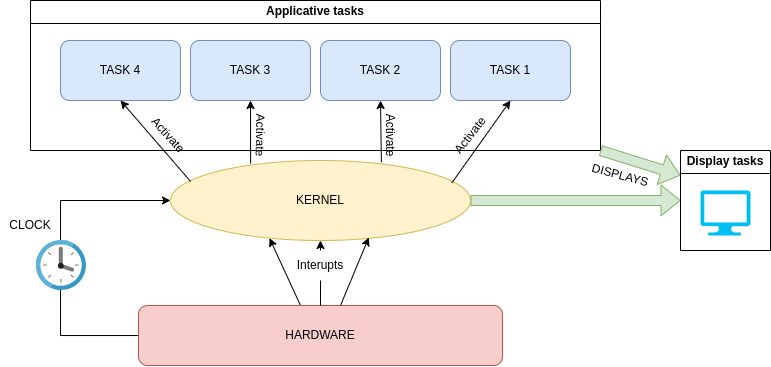
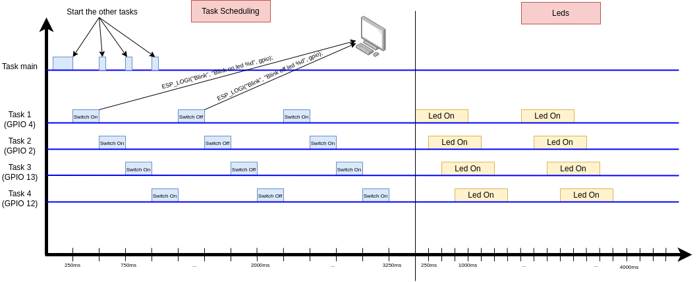

# tp1-real-time

## Schema general du systeme



## Code 

`chenillard.c`
```C
/**
 * @brief Task to blink an LED on a specified GPIO pin.
 *
 * This task will toggle the specified GPIO pin on and off every second,
 * logging the state changes to the console.
 *
 * @param pvParameters Pointer to the GPIO number to blink.
 */
void blink_led(void *pvParameters)
{
    int* parameters = (int *)pvParameters;
    int gpio = *parameters;
    
    esp_rom_gpio_pad_select_gpio(gpio);

    gpio_set_direction(gpio, GPIO_MODE_OUTPUT);

    while (1)
    {
        /* Blink off (output low) */
        ESP_LOGI("Blink", "Blink off led %d", gpio);
        gpio_set_level(gpio, 0);
        vTaskDelay(1000 / portTICK_PERIOD_MS);

        /* Blink on (output high) */
        ESP_LOGI("Blink", "Blink on led %d", gpio);
        gpio_set_level(gpio, 1);
        vTaskDelay(1000 / portTICK_PERIOD_MS);
    }

    vTaskDelete(NULL); //Delete this task if it exits from the loop above
}
```

`main.c`
```C
#define BLINK_GPIO 4
#define STACK_SIZE 2048

/**
 * @brief Main function to create tasks for blinking LEDs on different GPIOs.
 *        The tasks then blink the LEDs on GPIOs 4, 2, 13, and 12.
 *        The kernel organizes the tasks in a round-robin fashion when we delay a task.
*/
void app_main()
{
    int gpio4 = 4;
    int gpio2 = 2;
    int gpio13 = 13;
    int gpio12 = 12;

    xTaskCreate(blink_led,
                "blink_led3",
                2048,
                &gpio4,
                5,
                NULL);

    vTaskDelay(250 / portTICK_PERIOD_MS);
    xTaskCreate(blink_led,
                "blink_led2",
                2048,
                &gpio2,
                5,
                NULL);

    vTaskDelay(250 / portTICK_PERIOD_MS);
    xTaskCreate(blink_led,
                "blink_led13",
                2048,
                &gpio13,
                5,
                NULL);

    vTaskDelay(250 / portTICK_PERIOD_MS);
    xTaskCreate(blink_led,
                "blink_led12",
                2048,
                &gpio12,
                5,
                NULL);
} 
```

## Chronogramme


